# Team Nolimits

  

Repo for the Lablab.ai [multimodal hackaton Nov 2023](https://lablab.ai/event/multimodal-hackathon)
See the app @ [gpt4v-demo.streamlit.app](https://gpt4v-demo.streamlit.app/)

Beware, that, sometimes, the app crashes... so just reload it.

### Streamlit screenshot

  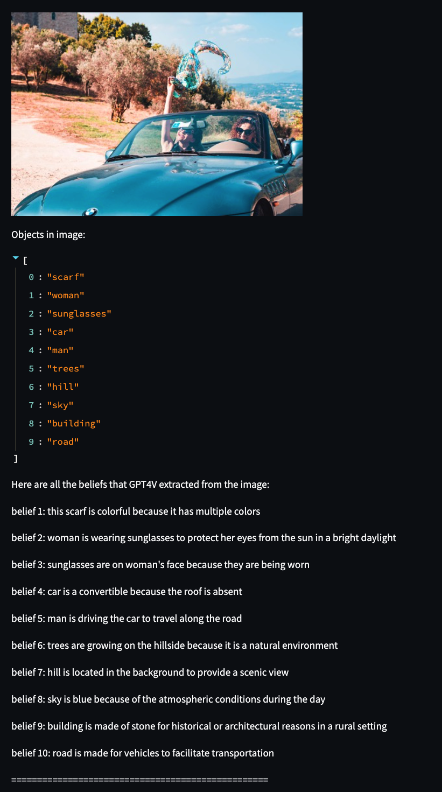

  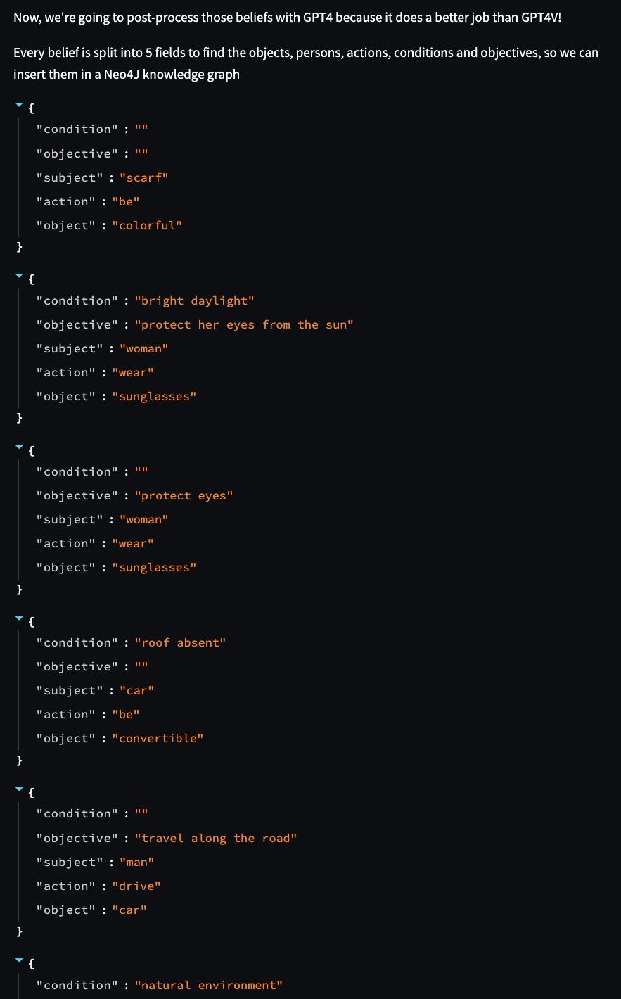

  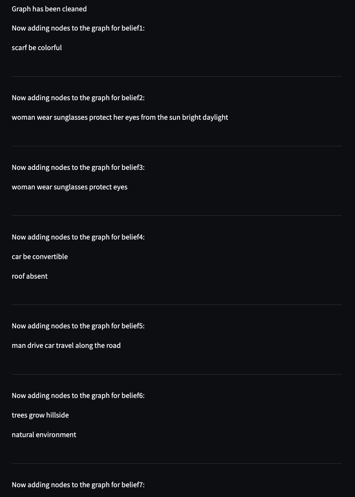

### Notice how the fields 'objective' and 'condition' under 'Node Properties' on the right are spot on!

  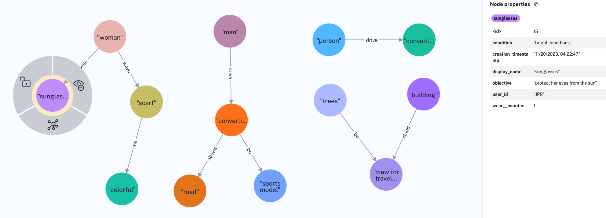

  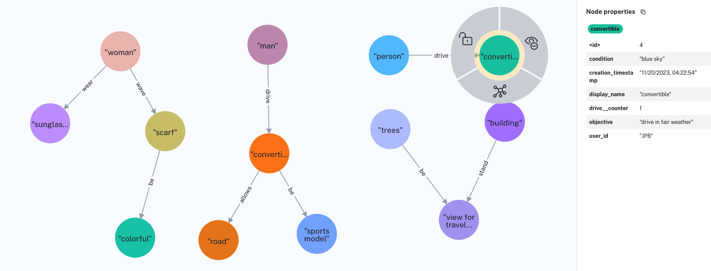

  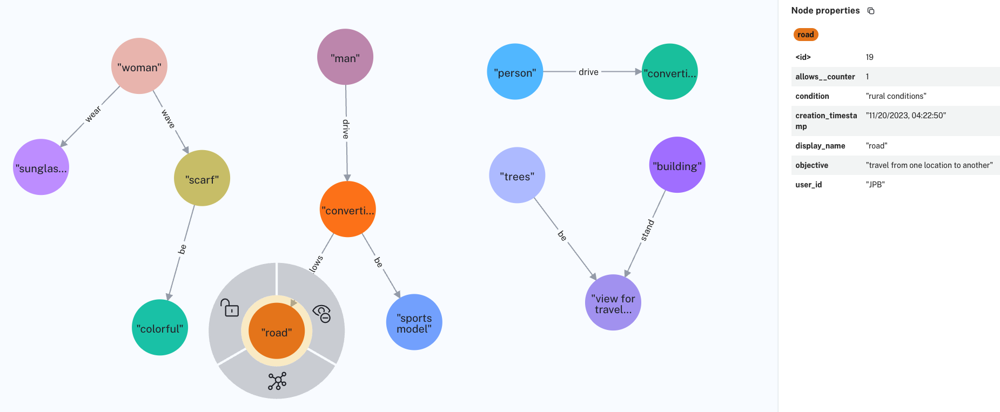

  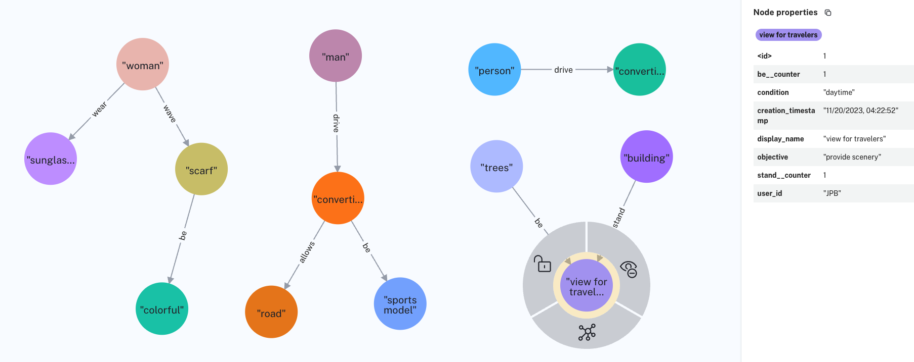

  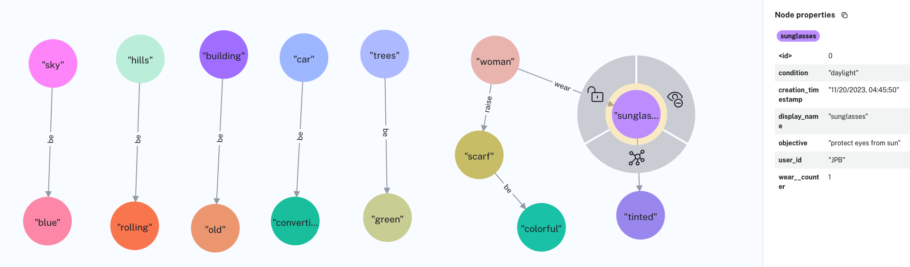

  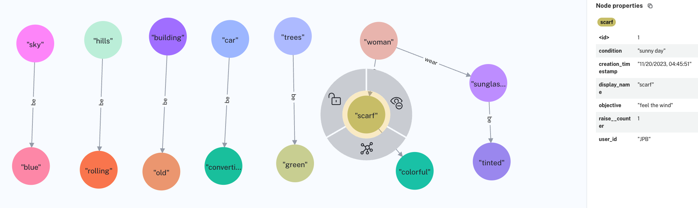

  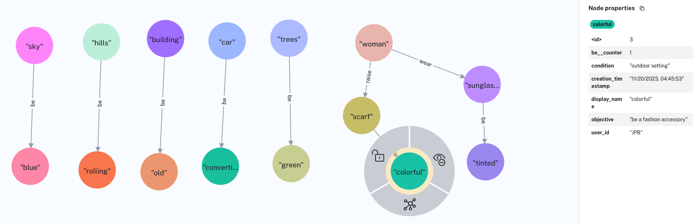

  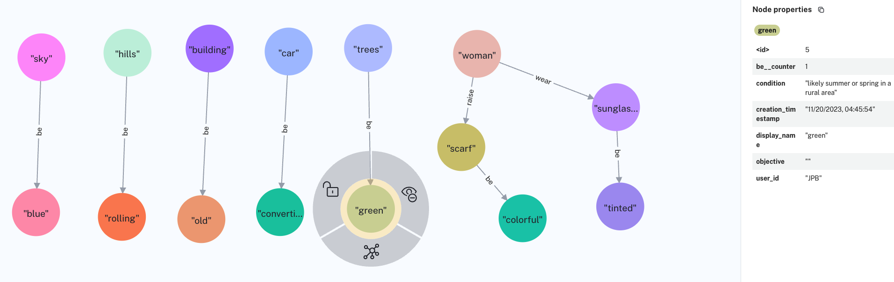

  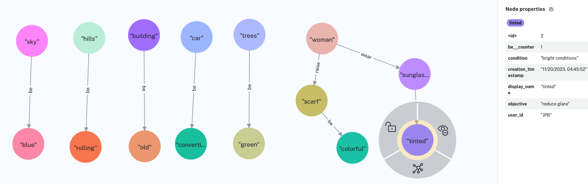

  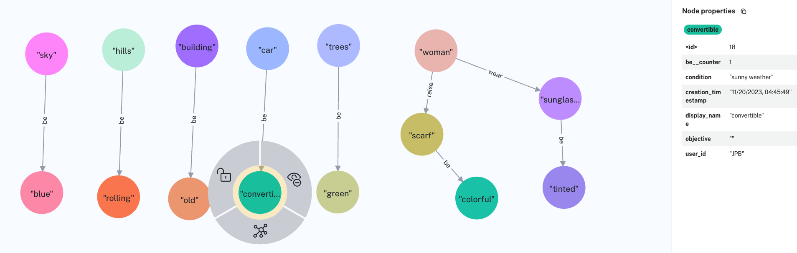

  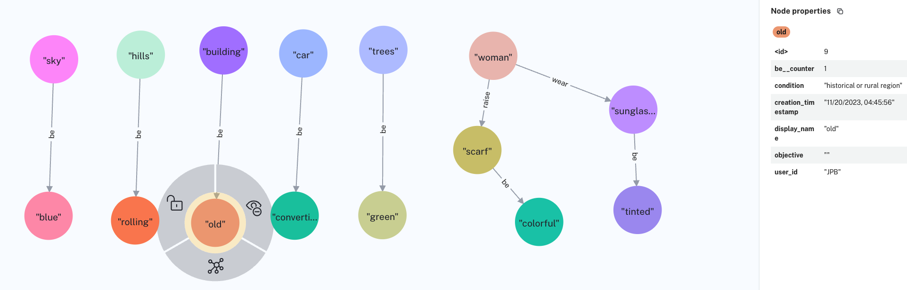

  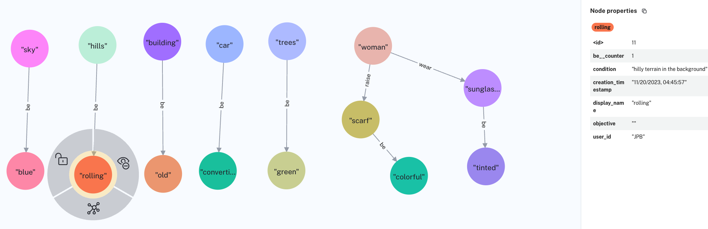

